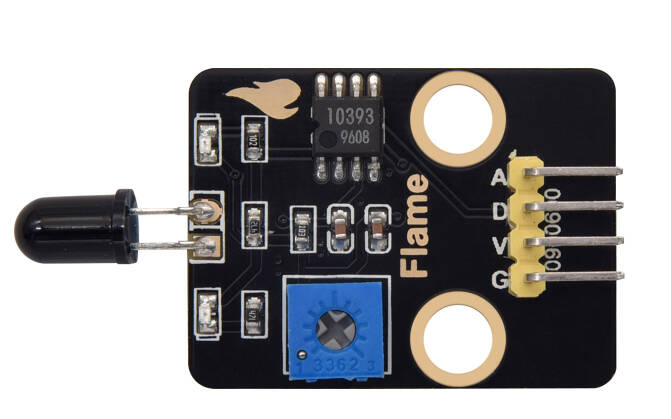
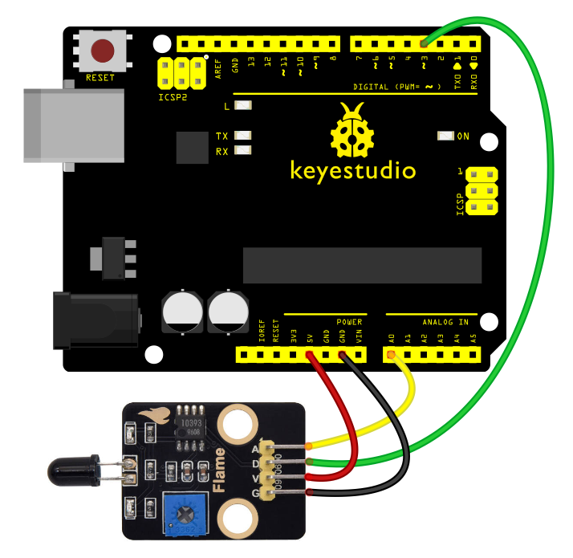

# keyestudio Flame sensor Module



## 1. Introduction

This tutorial explains how to use a Flame sensor with an Arduino.
You will learn how to use flame sensors to detect flames in the environment and display the detection status and signal values in real time on a serial monitor.
The flame sensor is a low-cost, highly sensitive analog/digital dual-output sensor. Its core is to collect signals by detecting the unique infrared spectrum of the flame. Its wiring is simple and it is compatible with mainstream microcontrollers such as Arduino. It can output both digital switch signals (to determine whether there is a flame or not) and analog signals (to reflect the intensity/distance of the flame), without the need for additional amplification or conversion circuits. It is suitable for scenarios such as fire alarm and flame tracking.

## 2.Specifications

| Parameter         | Description                  |
| ----------------- | ---------------------------- |
| Operating Voltage | DC 5V                        |
| Connection method | AO/DO                        |
| Dimensions        | Length：42 mm     Width：23 mm |

## 3.Required Materials

- Arduino Uno （Compatible with ESP32, STM32, Raspberry Pi, and others）
- keyestudio Flame sensor Module
- Jumper wires

## 4.Wiring Instructions（Arduino UNO R3)

| Flame sensor Module Pin | Arduino Pin               |
| ----------------------- | ------------------------- |
| VCC                     | 5V                        |
| GND                     | GND                       |
| DO                      | D3（or other digital pins） |
| AO                      | A0（or other analog pins）  |



## 5.Sample Code

Read the flame presence and intensity using the flame sensor (analog/digital dual-output) and display the detection values in the Serial Monitor.

```c
int flamePin_D = 3; // Define digital pin 3 (for digital output of flame sensor) 
int flamePin_A = A0; // Define analog pin A0 (for analog output of flame sensor) 
int ledPin = 13; // Define digital pin 13 (for indicator LED) 

// Variables to store sensor states 
int State_D = 0; // Digital state variable (stores flame presence status) 
int State_A = 0; // Analog state variable (stores flame intensity value) 
void setup() { 
    Serial.begin(9600); // Initialize serial communication at 9600 baud rate 
    pinMode(ledPin, OUTPUT); // Set ledPin as output pin 
    pinMode(flamePin_D, INPUT); // Set flamePin_D as input pin 
    } 
void loop() { 
    State_D = digitalRead(flamePin_D); // Read digital pin value and assign to State_D 
    State_A = analogRead(flamePin_A); // Read analog pin value and assign to State_A 
    Serial.println(State_A); // Print analog value to serial monitor 
    if (State_D == LOW) { // When flame is detected (digital pin outputs LOW) 
    digitalWrite(ledPin, HIGH); // Turn on indicator LED 
    } else { 
    digitalWrite(ledPin, LOW); // Turn off indicator LED 
    } 
}
```

**Experimental phenomena：**

- After uploading the code to your Arduino and opening the Serial Monitor (set to 9600 baud rate), The Arduino will start reading flame detection data (digital presence status and analog intensity value) from the flame sensor.
- Adjust the potentiometer on the module to set it at the critical point where the D1 indicator light on the module toggles between on and off, and then keep the D1 light turned off.
- When no flame is detected by the sensor, the D1 light on the sensor remains off, and the D13 indicator light on the board is also off.
- When the sensor detects a flame, the D1 light on the sensor turns on, and the D13 indicator light on the board turns on as well.
